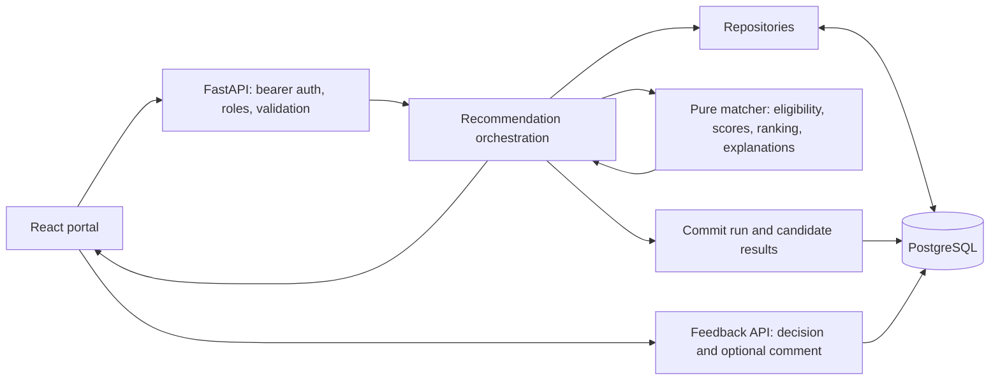

# SkillMatch AI stakeholder presentation

**Presenter:** James Lambert  
**Target:** 12 minutes, including live interaction; required range 10–15 minutes.  
**Status:** Recording script, not a completed video. Rehearse and measure the actual
recording; the time windows below are a plan, not observed duration.

Read the quoted paragraphs aloud in your own voice. Directions under **Show** are
screen actions, not narration. Use the [recording checklist](recording-checklist.md)
before filming. Metrics come from [repository evidence](../evidence/unit8/repository-evidence.md).

## 0:00–1:10 — Problem and intended users

**Show:** Title: “SkillMatch AI — Explainable workforce recommendations,” with
James Lambert underneath. Then show the OPEN job list.

> Hello, I'm James Lambert. SkillMatch AI is a workforce decision-support
> application that helps supervisors compare employees with job requirements.
>
> The problem is that a job title alone does not show whether someone has the
> required skills, current certifications, or relevant experience. Reviewing that
> evidence manually can make staffing decisions slow and difficult to explain.
> Missing a mandatory certification also has a different meaning from missing a
> preferred skill, so treating every gap the same would produce misleading results.
>
> SkillMatch brings structured employee evidence and job requirements into one
> workflow. It ranks candidates, explains the comparison, and preserves the run
> behind the recommendation. A supervisor still makes the decision. The application
> records feedback without automatically assigning anyone.

## 1:10–2:25 — Solution and architecture

**Show:** This diagram, rendered in a Markdown viewer, or a slide containing it.

> The system uses React for the portal, FastAPI for the REST API, and PostgreSQL
> for persistence. The backend is a feature-oriented modular monolith: employee
> profiles, job requirements, recommendations, and feedback have distinct
> responsibilities inside one application.
>
> The recommendation orchestrator connects these modules. It reads a job and
> eligible input profiles through repositories, passes structured data to the
> matcher, and persists the resulting run before returning it to the portal.
>
> The matcher has no HTTP or database responsibilities. That boundary makes the
> scoring rules easier to test independently and keeps infrastructure changes
> separate from ranking behavior. The current system runs the matcher in-process,
> which avoids adding a service boundary that this prototype does not yet need.

## 2:25–3:35 — Structured evidence and scoring

**Show:** Commercial Electrician requirements; an employee profile showing skills
and dated certification evidence. Return to the job before requesting results.

> Employees have structured skills, certification records, experience, and status.
> Jobs distinguish required and preferred skills and identify mandatory credentials.
>
> The AI component is a deterministic, rule-based recommendation engine. Its
> scoring model uses required skills, preferred skills, certifications, and
> experience, with base weights of 55, 20, 15, and 10 percent. The implementation
> adjusts the weights when a scoring category is absent.
>
> Eligibility is evaluated separately. Non-ACTIVE employees are ineligible, and
> production recommendation input excludes them. Missing a valid mandatory
> certification also makes a candidate ineligible. Missing required skills lowers
> the score without automatically excluding the employee.
>
> This separation allows a supervisor to distinguish an evidence gap from a hard
> eligibility failure. It also keeps the recommendation explainable rather than
> presenting an unexplained score as the entire decision.

## 3:35–6:00 — Live recommendations and feedback

**Show:** Sign in with a configured SUPERVISOR account. Select Commercial
Electrician, set maximum results to 10 and minimum score to 0, enable missing
skills and credentials, and request recommendations. Expand or scroll through
candidate evidence. Point to a high-scoring and a lower-scoring eligible result.

> I am now requesting recommendations through the running portal. This action
> goes through the real API and database, rather than a static results screen.
>
> Here are the ranked candidates. For each candidate, I can inspect the final
> score, component scores, eligibility, matched and missing evidence, and the
> explanation. I will compare these two candidates using the evidence currently
> displayed, rather than assuming the highest score means the best person in
> every staffing situation.

**Pause:** Describe two actual visible differences in the current results. Do not
memorize fixture scores as live results: credential validity and edited profiles
can change them. Default recommendations omit ineligible candidates; do not claim
this screen demonstrates a missing mandatory credential unless one is visible.

> The response also identifies the match run and model version. These let a
> reviewer refer back to the specific recommendation instead of relying on a
> screenshot without context. The saved result preserves the evidence from that
> run even when profiles change later.
>
> I can now record a supervisor decision. SELECTED requires an eligible employee
> from the run. NOT_SELECTED and DEFERRED are also available, with an optional
> comment. I will record DEFERRED because this is a demonstration, with a comment
> explaining that no staffing action is being taken.

**Show:** Submit DEFERRED and the optional demonstration comment. Show the success
confirmation and match-run ID.

> This confirmation records feedback against the run. It does not assign an
> employee or change the live model. That is the human-control boundary of the
> application.

## 6:00–7:15 — Profile integrity and error recovery

**Show:** Sign out and use an ADMIN account. Open an employee profile and its
version. For a rehearsed concurrency demonstration, open the same profile in two
tabs, make one harmless edit and save in the first tab, then try saving the older
version in the second. Show the conflict and reload action. Restore the demo edit.

> Administrators maintain employee and job profiles. Updates carry the version
> that was read. If another change has already been saved, the older update receives
> a STALE_VERSION conflict instead of silently overwriting newer information.
>
> The portal keeps the draft and offers an explicit reload. This makes the conflict
> visible and lets the user decide how to reapply the change.
>
> API errors use structured problem responses and request IDs. The portal renders
> useful messages instead of raw JSON. Database or matching failures produce typed
> service errors, and failed matching does not leave a partially persisted run.

**If the two-tab action is unavailable:** Show the actual passing stale-version
browser test and identify it as automated evidence. Do not describe it as a live
conflict demonstration.

## 7:15–8:55 — Testing and reliability evidence

**Show:** Repository evidence table, coverage summaries, browser-test results,
then the CI workflow. If available, show the verified final-commit Actions summary.

> The local backend suite passed 382 tests, and the frontend suite passed 91 tests.
> Backend statement coverage was 97.21 percent and branch coverage was 89.23
> percent. Frontend line coverage was 94.89 percent and branch coverage was 81.81
> percent. These measures help identify exercised code and untested branches;
> they do not prove that every possible behavior is correct.
>
> Three browser scenarios passed against PostgreSQL. They covered recommendations
> and feedback, employee profile changes, and job profile changes, including stale
> versions and permanent deletion. An independent database session also verified
> the saved run, candidates, and SELECTED feedback from the automated scenario.
>
> The CI workflow runs backend lint and tests, frontend lint, tests and build, and
> PostgreSQL browser integration. Its aggregate required check depends on every
> job succeeding. The updated workflow also uploads coverage artifacts.

**Evidence branch:** If you have verified the final run, show its SHA and actual
job conclusions and state those results. Otherwise say:

> I have a supplied hosted frontend summary showing 91 passing tests. The complete
> hosted result and final commit identity still need verification. The results
> I have presented here are the observed local checks.

**Deployment branch:** Show actual deployment evidence only if available and
verified. Otherwise say:

> The demonstrated environment is local. Hosted deployment evidence remains an
> outstanding portfolio requirement.

## 8:55–10:15 — Performance and scalability limits

**Show:** `recommendation-benchmark.json`, especially environment, run count,
P95, target, and persistence counts. Keep the numbers legible.

> The performance target is recommendation P95 latency below two seconds for up
> to 100 ACTIVE profiles, measured over at least 30 runs.
>
> The local benchmark used 100 ACTIVE profiles, one job, five excluded warm-up
> requests, and 30 measured requests. It included bearer validation, PostgreSQL
> reads, scoring and explanations, committing the run, and receiving the response.
> All measured runs persisted 100 candidate results.
>
> The observed P95 was approximately 39 milliseconds, which met the local target.
> The benchmark used PostgreSQL 14.24, one Uvicorn worker, and one sequential client
> on WSL2. The raw samples and measurement method are stored in the repository.
>
> This result establishes performance for that test condition. It does not
> establish concurrent-user capacity or production scalability. The profiles were
> synthetically expanded from the mock dataset. Concurrent load, larger datasets,
> and realistic deployment latency would be the next performance evaluations.

## 10:15–11:15 — Stakeholder value and tradeoffs

**Show:** Results page beside the saved evidence summary, or a concise slide:
“Explainable comparison / Credential eligibility / Historical evidence / Human decision.”

> The practical value is a consistent, inspectable comparison of employees with
> job requirements. Supervisors can see evidence gaps, administrators can maintain
> profiles, and reviewers can refer to a stored run and its feedback.
>
> These are implemented capabilities. I have not measured time savings, staffing
> outcomes, or independently validated recommendation relevance. Those would
> require user evaluation and curated acceptable matches, not just a spread of
> scores in a demonstration dataset.
>
> The main tradeoffs are a simple local credential system, structured evidence
> instead of free-text interpretation, and an in-process matcher. They keep the
> prototype understandable, but production delivery would need further security,
> deployment, operational, and relevance evaluation.

## 11:15–12:00 — Contribution and close

**Show:** Closing slide with James Lambert, repository URL, evidence location,
and three next steps: deployment evidence, independent review, relevance evaluation.

> This was assigned as a three-person project, but I completed the implementation
> and integration work individually because the other assigned members did not
> provide implementation contributions. I adapted by prioritizing the end-to-end
> workflow, preserving module boundaries, and using automated tests and recorded
> evidence to check the system. I used AI-assisted development and review support;
> that support does not replace independent peer review.
>
> SkillMatch now demonstrates the path from structured job and employee evidence
> to explainable recommendations, stored results, and supervisor feedback. The
> next delivery priorities are verified deployment evidence, independent review,
> and curated relevance evaluation. Thank you.

Verify and personalize the contribution paragraph before recording. Add other
assigned members' names and accurate contributions in submission documentation
when known; do not invent names or represent an unapproved solo arrangement as
instructor-approved.
